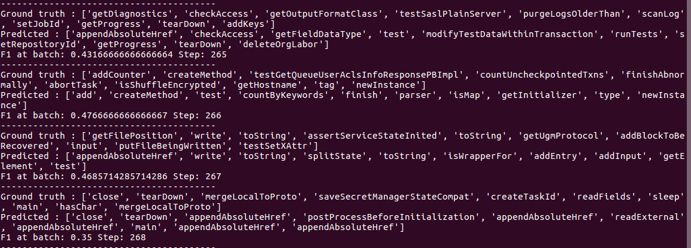

## A Tensorflow Implementation of Gated Graph Neural Networks (GGNN) for Method Name Prediction

### Download data

```
python3 download_data.py
```
This script will download the three datasets java-small, java-med and java-large (only the testing part) to the directory data/

### Download pretrained model

```
python3 download_pretrained_model.py
```
This script will download the pretrained models for the three datasets into the directory model/


### Test the model
```
source test_ggnn_method_name_prediction.sh
```

It will print some thing like this on the console:


Then it means that you have done the steps correctly.

There is a parameter called Dataset in the script ```test_ggnn_method_name_prediction.sh```, it will point to the corresponding model and the corresponding dataset to test.
At the moment, default is Dataset=java-small, you can change to Dataset=java-med or Dataset=java-large for test on the java-med and java-large dataset.
